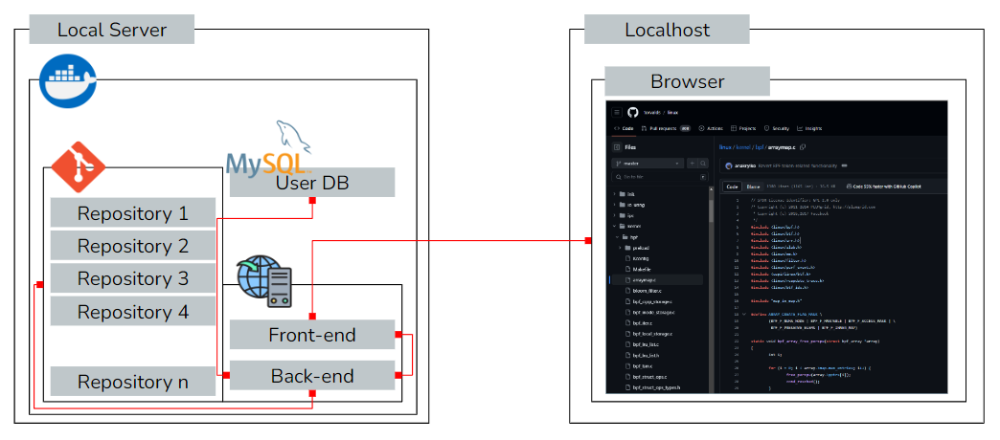

# KMU Computer Engineering 2024 Capstone Design Project 2
> Capstone design project in Keimyung-univ.

Git 및 Web Server가 탑재된 Ubuntu Docker Image

| 참여 | 역할 |
| --- | --- |
| [이성욱](https://github.com/elecbug) | 서류, 백엔드 |
| [이서원](https://github.com/dnjsl) | 백엔드 |
| [최유정](https://github.com/adelklee) | 백엔드 |
| [옥승호](https://github.com/Seunghook) | 프론트엔드 |
| [박재홍](https://github.com/Hong6968) | 프론트엔드 |
| [Ducanhtran](https://github.com/datbg152) | 프론트엔드 |
| 권준희 | 서류 |

## 주제

> Ubuntu Docker를 사용한 소형 기업 및 개인용 간편 Git Server와 Web Page Image

### 대상

개발 서버가 필요한 소형 기업 및 개인 사용자

### 설계도

### 결과물
